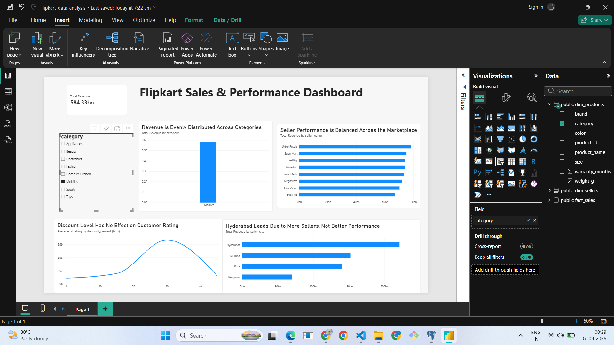

# Flipkart E-Commerce Data Analysis & Warehouse

## Overview
End-to-end data analysis project: raw data → PostgreSQL data warehouse → 
SQL business analysis → Power BI dashboard.

## Tech Stack
Python (pandas, SQLAlchemy) | PostgreSQL | SQL | Power BI (DAX)

## Architecture
Raw CSV → Staging Table → Star Schema (dim_products, dim_sellers, fact_sales) → 
Power BI Dashboard

## Business Questions Answered
1. Revenue distribution across categories
2. Seller performance (revenue & rating)
3. Discount impact on units sold and rating
4. Delivery speed vs customer rating
5. Return policy consistency across categories
6. City-wise seller performance

## Key Insights
- Revenue is evenly distributed across all product categories (~₹600 Cr each)
- Discount percentage has negligible impact on sales volume or rating
- [add 2-3 more of your findings]

## Dashboard Preview

## Files
- `/Business_problem` - All business question queries
- `/Load_Data` - ETL script for data loading
- `/report` - Full findings summary
- `/Screenshots`- Business question table screenshots And Dashboard Screenshots
